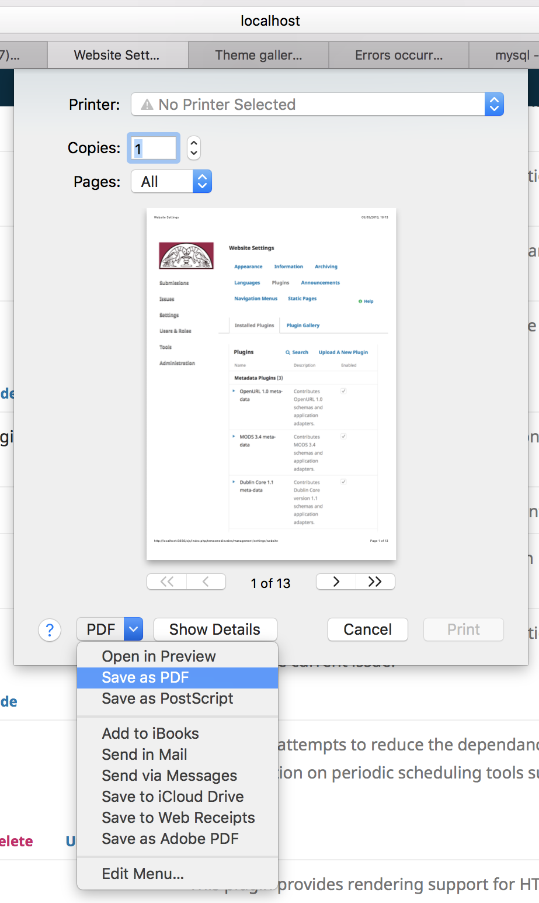

### Technical requirements ##

* Hardware
     - Macbook 13"
     - Notebook Dell 15"
     - Ipad Air 2
     
* Software
     - PDF
          - [doPDF](https://www.dopdf.com/): impresora PDF (sistema operativo: Microsoft Windows)
          - [BullZip](http://www.bullzip.com/products/pdf/info.php): impresora PDF (sistema operativo: Microsoft Windows)
          - [PDFCreator](https://www.pdfforge.org/pdfcreator): impresora PDF (sistema operativo: Microsoft Windows)
          - [Foxit PDF Printer](https://www.foxitsoftware.com/downloads/): impresora PDF (sistema operativo: Microsoft Windows)
          - [PDF-XChange Lite Printer](https://www.tracker-software.com/product/pdf-xchange-lite): impresora PDF (sistema operativo: Microsoft Windows)
          - [SodaPDF Printer](https://www.sodapdf.com/installation-guide/): impresora PDF (sistema operativo: MacOSX)
          - [MacOSX PDF Printer](https://support.apple.com/es-lamr/guide/mac-help/mchlp1531/10.13/mac/10.13): impresora PDF (sistema operativo: MacOSX)
            
          
          - [Alchemy](https://dawnlabs.github.io/alchemy/): impresora PDF (sistema operativo: MacOSX)
     - Graphic converter
          - [XnView MP](https://www.xnview.com/en/xnviewmp/): convertidor de gráficos (varios formatos). Puede ser ejecutado en estos sistemas operativos: Windows | Mac | Linux
     - Remote control
          - [RemoteUtilities](https://www.remoteutilities.com/)
          - [Chrome Remote Desktop](https://remotedesktop.google.com/)
          - Windows Remote Desktop: incluído dentro del mismo sistema operativo Microsoft Windows
     - Notifications
          - [Muzzle](https://muzzleapp.com/): disable notifications on MacOSX platform

* Online tools
     - Time management:
          - [Time scheduler](https://time.is/es/): check/verify official time of host country
          - [World Time zones](https://everytimezone.com/)
          - [Time.io](https://timee.io/)
          - [Clocker](https://apps.apple.com/us/app/clocker/id1056643111?mt=12)
          - [everytimezone](https://everytimezone.com)
     - File sharing:
          - [File Pizza](https://file.pizza/): file sharing over peer-to-peer protocol
     - Calendar sharing:
          - [Calendly](https://calendly.com/)
     - [Plantuml](http://www.plantuml.com/plantuml/uml/): Diagram / deployment diagram / critical path

     
### Legal ###

* All trademarks are the property of their respective owners.
