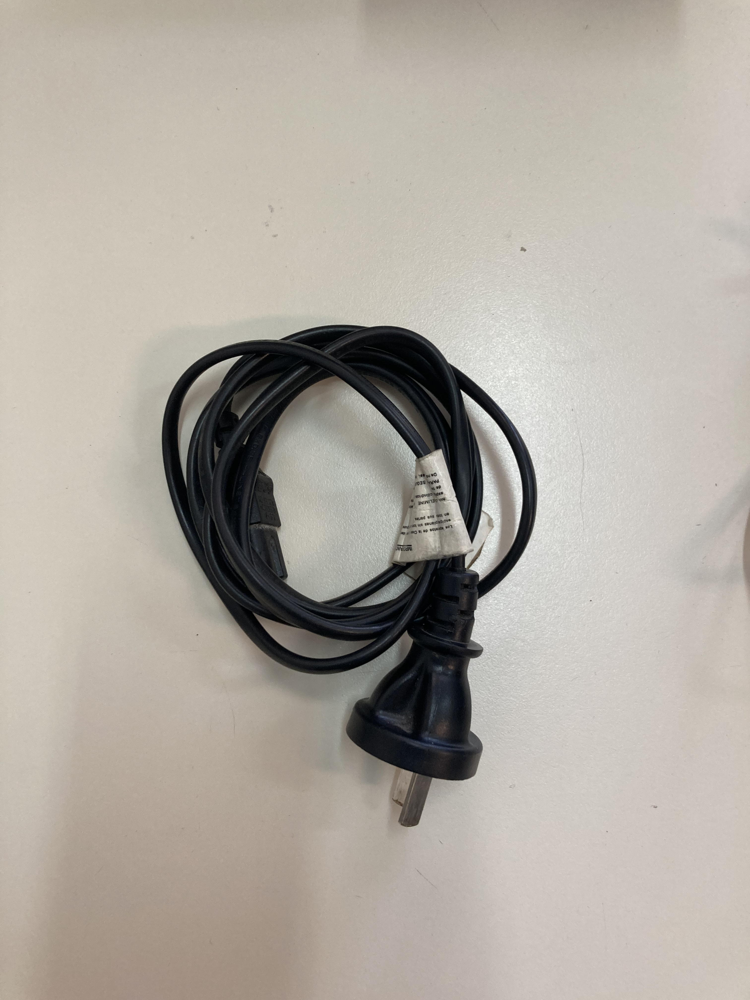
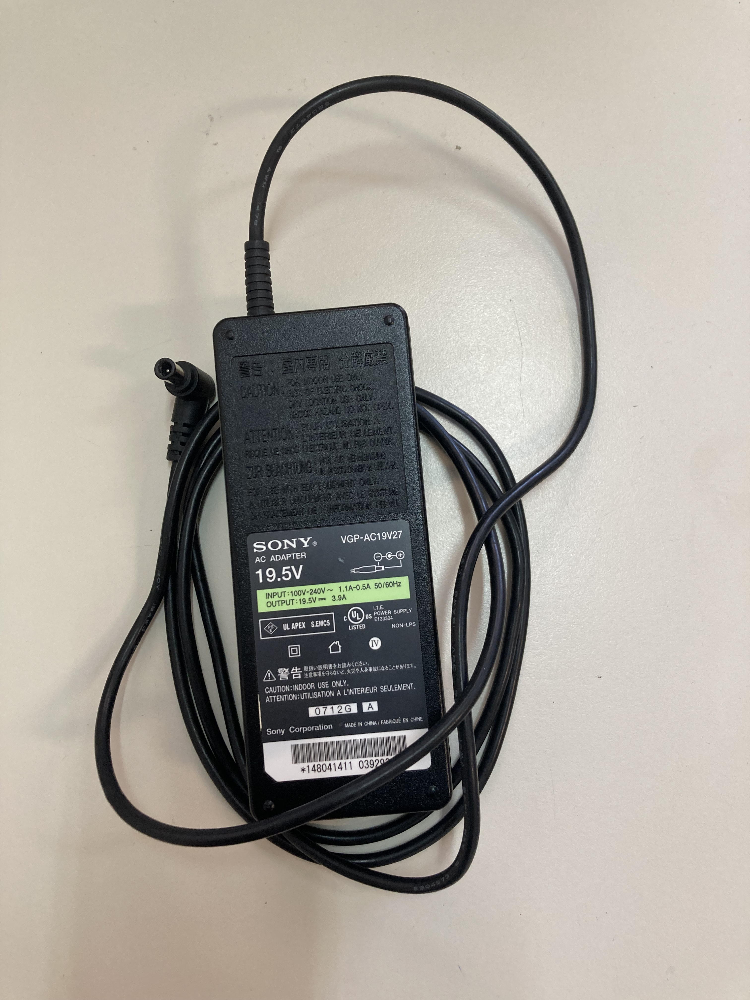
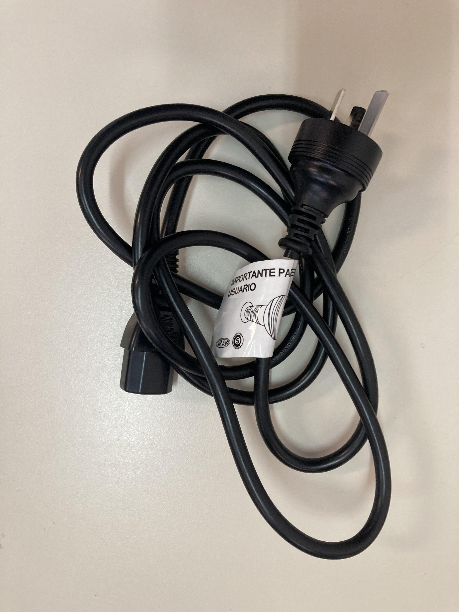
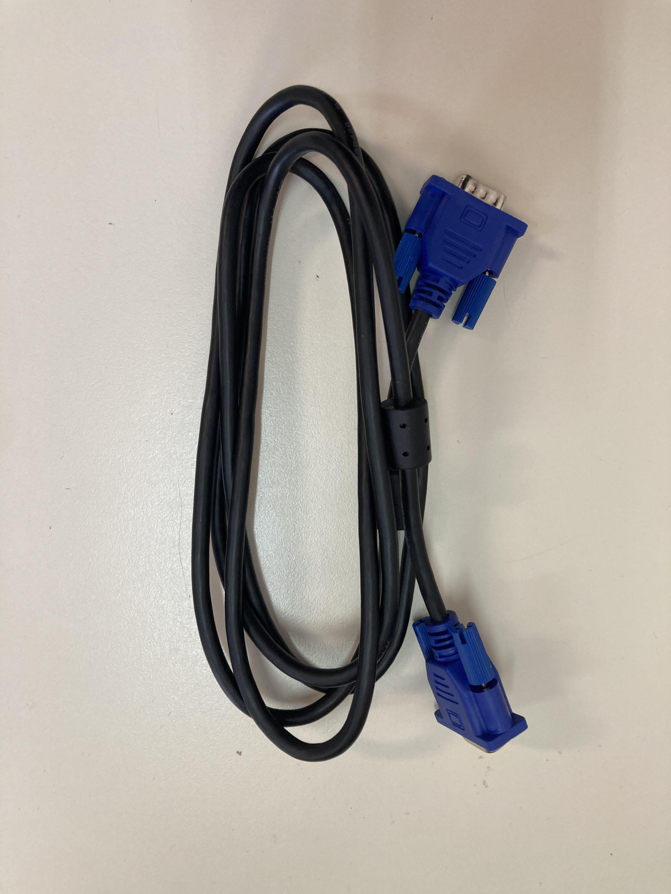
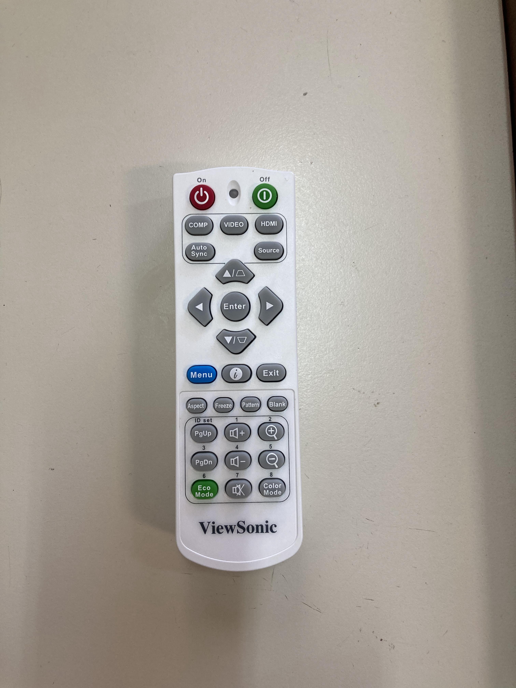
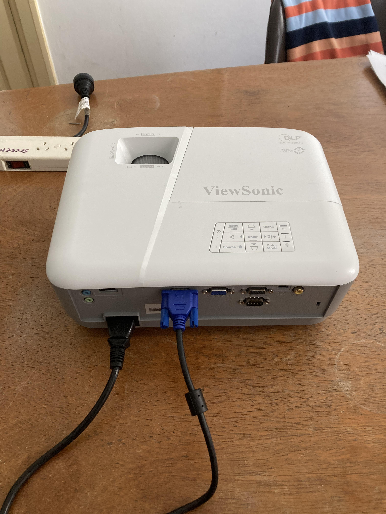
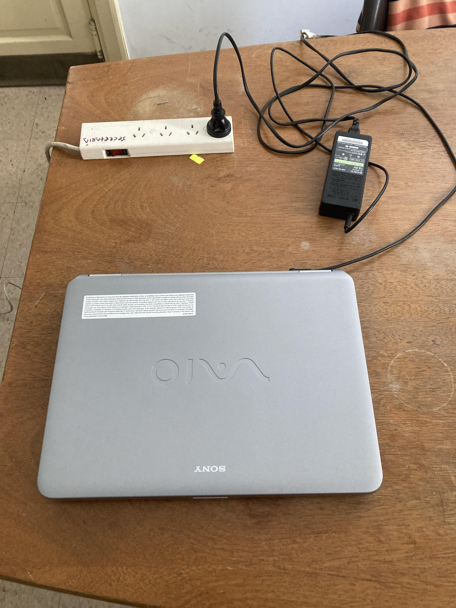
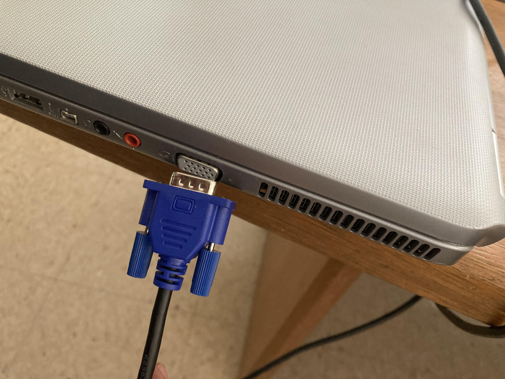
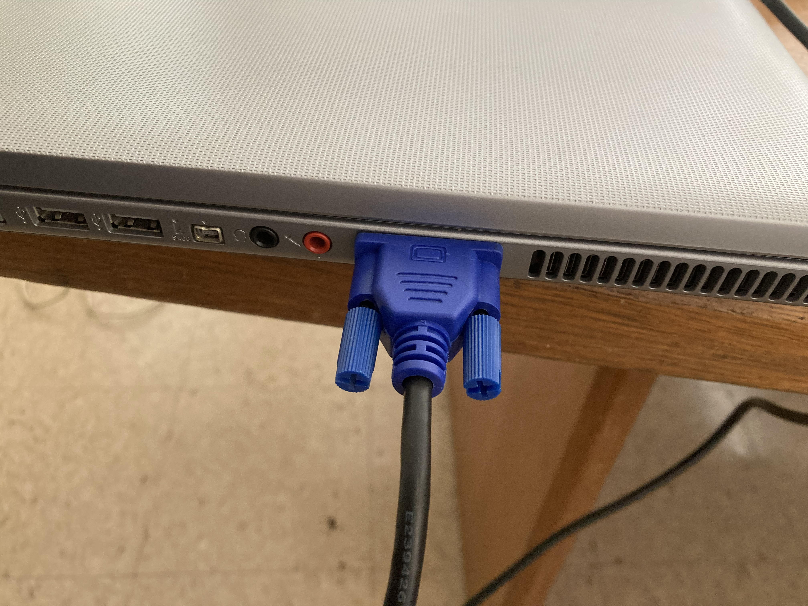
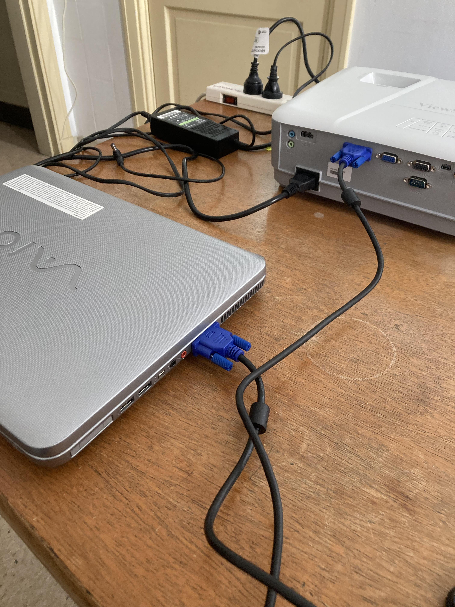

### Elementos
### Sony Vaio

_Figura 1_
  

_Figura 2_
  

_Figura 3_
  
---
### ViewSonic DLP Projector

_Figura 4_
  

_Figura 5_
  

_Figura 6_
  

_Figura 7_
  
---
### Prolongador (_aka_ zapatilla eléctrica)

_Figura 8_
  
---
### Despliegue
* Verificar que no falte ningún cable ni dispositivo
* Desempacar la notebook, el proyector y el prolongador 
* Disponer la notebook Sony Vaio, el proyector ViewSonic DLP Projector y el prolongador de enchufes sobre una superficie horizontal, sin declives y con suficiente espacio entre los mismos; en una habitación con suficiente ventilación (computadora y proyector emanan ingentes dosis de calor)
* Conectar un extremo del cable de la batería con la notebook y el otro extremo con el prolongador

---
* Pasemos al proyector: conectar un extremo del cable (negro) con el proyector y el otro extremo con el prolongador de enchufes 

* Conectar un extremo del cable con su identificación azul

	 en el primer enchufe del proyector y la notebook:

 

